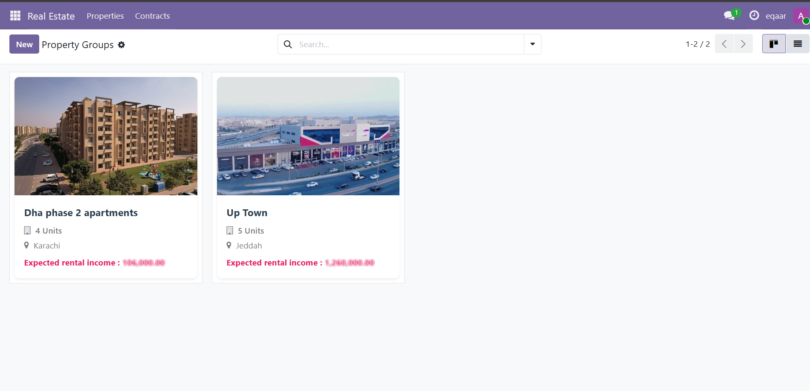
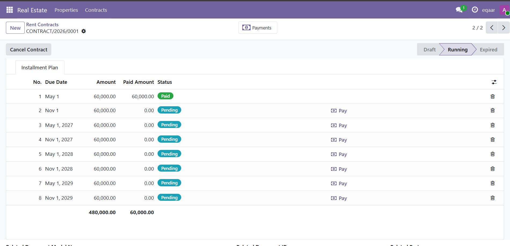
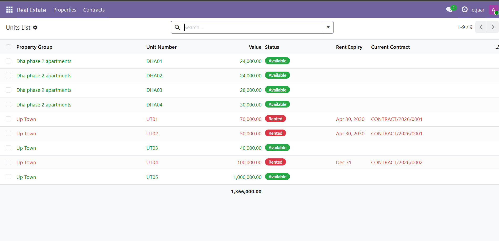

# Real Estate ERP & Rental Installment Engine

Developed a custom property tracking module within an Odoo ERP infrastructure designed to manage high-volume property assets and lease logistics.

## Core Core Modules
1. **Asset Mapping:** Grouped property complexes integrated with precise Google Maps geolocation data.
2. **Utility & Lease Tracking:** Live dashboards monitoring utility infrastructure meters alongside lease expiration alerts.
3. **Flexible Installment Scheduler:** Dynamic computation system supporting Monthly, Quarterly, and manual entries.

## System Interface
As shown in my architectural setup, here is how the relational database renders the split installments to corporate end users:

## Backend Architecture (Python)
See `code_samples/rent_installment.py` to inspect the full data schema mapping, dependencies, and dynamic computation engine.
