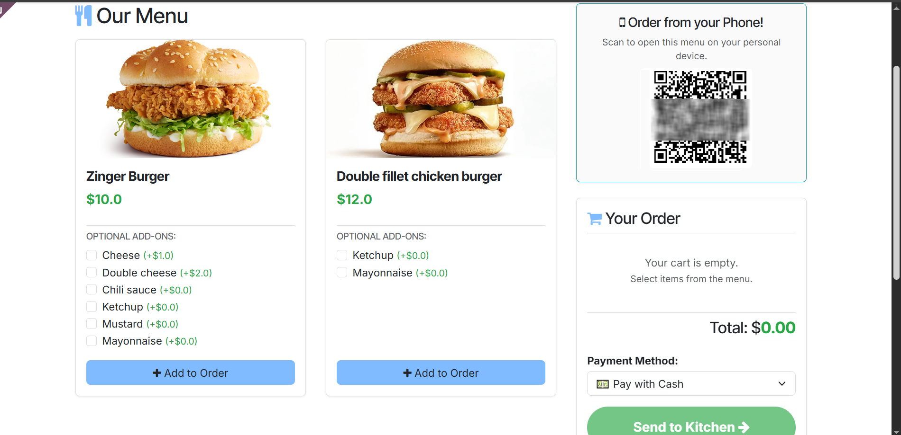
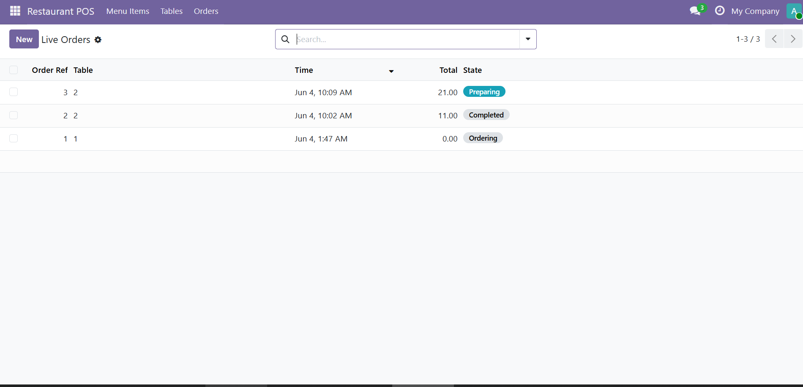

# Restaurant POS Ecosystem & QR Ordering Engine

An asynchronous point-of-sale (POS) architecture engineered to optimize high-volume Food & Beverage (F&B) workflows, eliminate transactional bottlenecks, and synchronize front-of-house dining requests with back-of-house kitchen operations.

## Core Functional Modules

1. **Live Kanban Order Pipeline:** Real-time state-tracking framework handling swift transaction mutations (`Ordering`, `Preparing`, `Ready`, `Completed`) synchronized across cashier stations and kitchen displays.
2. **QR-Based Self-Ordering Matrix:** Direct guest menu accessibility supporting dynamic item variant handling, custom ingredient modifiers, and localized tax rules.
3. **Asynchronous Order Routing:** Concurrency-optimized data pipeline that splits payload distributions, instantly routing preparation tickets to kitchen networks while updating localized financial ledgers.

## System Interface

Below are visual architectural layouts of the primary interface and the live backend ticket tracker:

## Backend Architecture (Python)

Refer to `code_samples/restaurant_order.py` to audit the data structures governing the complete order lifecycle state machine, multi-tier transactional subtotal computations, and the security logic managing table-bound token rotation.
