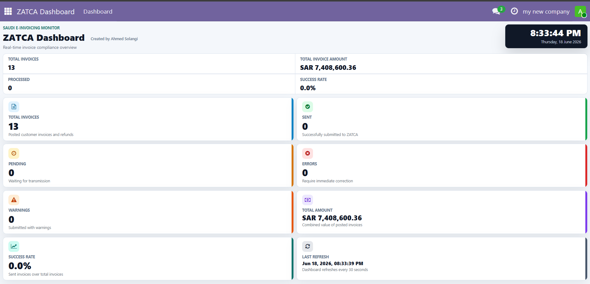
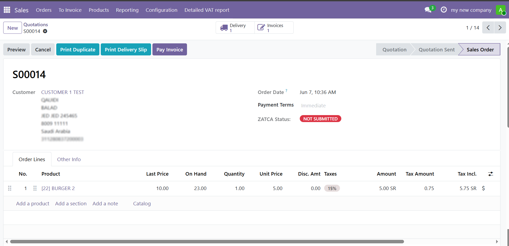

# ZATCA Phase-2 E-Invoicing & Compliance Integration

A secure, real-time data synchronization pipeline integrated into an Odoo ERP infrastructure, engineered to automate cryptographic clearance and reporting compliance in accordance with regional tax authority regulations.

## Core Functional Modules

1. **Phase-2 Cryptographic Clearance Engine:** Automated API integration managing cryptographic invoice signing, XML payload generation, and the dynamic compilation of compliant Phase-2 QR codes embedding digital signatures and cryptographic hashes.
2. **Compliance Analytics & Monitoring Dashboard:** A unified operational tracking interface providing real-time visibility into transaction validation states, API error diagnostics, system submission logs, and daily transactional counters.

## System Interface

Below are the visual layouts of the analytical compliance dashboard and the transactional status validation interface:

## Backend Architecture (Python)

Refer to `code_samples/zatca_dashboard.py` to audit the underlying backend implementation governing local timezone adjustments, automated record validation against official schema constraints, and relational database state updates.
